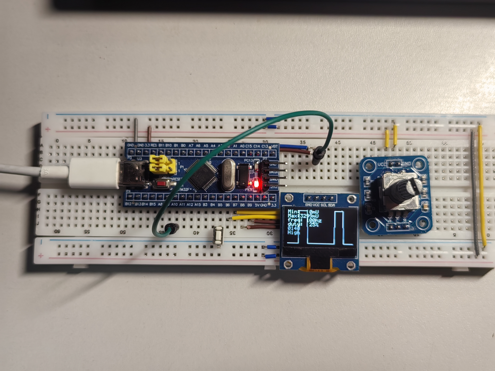

# 基于STM32f103c8t6的简易示波器

## 简介

手头缺个示波器，本打算买一个。上了淘宝发现有点贵，而且有些高级的功能我目前又用不到，买来也浪费。

于是打算用stm32f103c8t6做一个简易示波器，满足我的一些简单的测频需求。

示波器分为两种模式：测低频和测高频。可测量频率区间为1hz到9000hz，测高频时候误差为0.1%，这对我来说是足够了。

使用vscode的eide开发。

## 有哪些功能

1. 显示最高电压和最低电压
2. 测量输入PWM波形的频率
3. 测量输入PWM波形的占空比
4. 按下按钮选择测频模式：测低频、测高频
5. 显示波形
6. 调节旋钮编码器来对波形进行合适缩放

## 外设使用情况

* PA0引脚作为ADC1的输入进行数据采样，用于显示波形
* ADC1的采样用TIM3进行触发，采样频率为1khz
* PA1引脚作为TIM2的输入捕获用于测量输入PWM波形的频率和占空比
* 使用TIM4的CH1和CH2 ( PB6引脚和PB7引脚 ) 用于处理编码器的输入
* 使用TIM1产生测试用的PWM波形 ( 频率100hz，占空比25% )

## 引脚连接

## 后续改进

电压测量范围太小，只能测0到3.3v。之后改进，如果有时间的话.......
